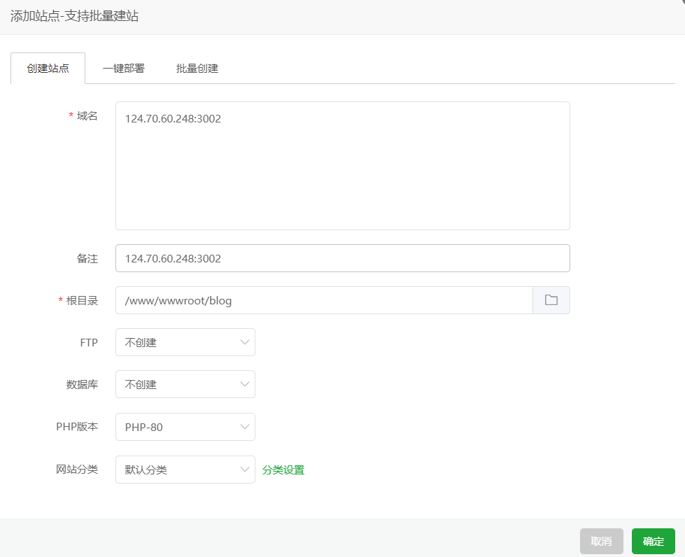

1. 在服务器上新建/www/wwwroot/blog文件夹
2. 修改.github/workflows/deploy.yml 为
    
    ```yaml
    name: 更新内容到服务器
    
    on:
        push:
            branches: [master]
        pull_request:
            branches: [master]
    
    jobs:
        build:
            runs-on: ubuntu-latest
    
            permissions:
                # Give the default GITHUB_TOKEN write permission to commit and push the
                # added or changed files to the repository.
                contents: write
    
            steps:
                - uses: actions/checkout@v4
                  with:
                      fetch-depth: 0
    
                - name: Cache Hugo resources
                  uses: actions/cache@v4
                  env:
                      cache-name: cache-hugo-resources
                  with:
                      path: resources
                      key: ${{ env.cache-name }}
    
                - uses: actions/setup-go@v5
                  with:
                      go-version: "^1.17.0"
                - run: go version
    
                - name: Setup Hugo
                  uses: peaceiris/actions-hugo@v2
                  with:
                      hugo-version: "latest"
                      extended: true
    
                - name: Build
                  run: hugo --minify --gc
    
                - name: 上传到服务器
                  uses: easingthemes/ssh-deploy@main
                  env:
                    # 私钥
                    SSH_PRIVATE_KEY: ${{ secrets.PRIVATE_KEY }}
                    ARGS: "-avzr --delete"
                    SOURCE: "./public/"
                    REMOTE_HOST: ${{ secrets.REMOTE_HOST }}
                    REMOTE_USER: "root"
                    TARGET: "/www/wwwroot/blog"
    
    ```
    
    `PRIVATE_KEY`  为本机私钥，通过`cat ~/.ssh/id_rsa` 获取
    
    `REMOTE_HOST` 为服务器IP
    
3. 提交代码到Github，成功的话会在服务器/www/wwwroot/blog文件夹里看见博客的静态页面文件
4. 在宝塔添加站点，如果有域名的话可以填写域名，这边暂时没有，所以直接写ip了
    
    
    
5. 访问网站：http://124.70.60.248:3002/ 成功😊